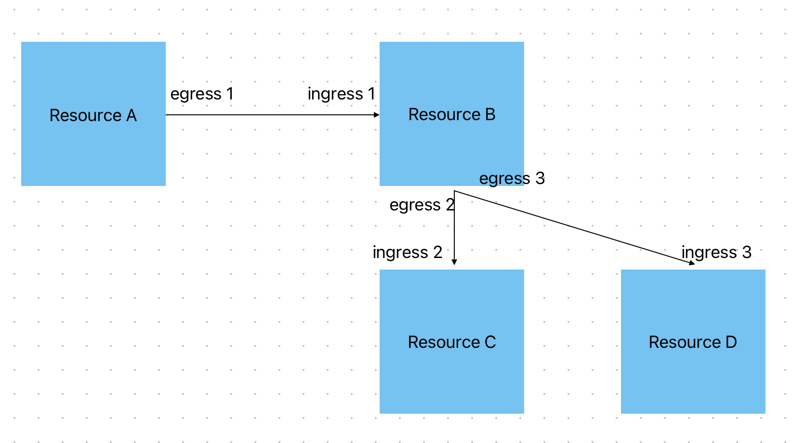

# Ddosify Distributed Tracing

Ddosify distributed tracing has two components:
- **Alaz:** Responsible for sending the traffic data between Kubernetes services
- **Backend:** Responsible for merging these traffic data to generate spans and traces. Also serves these data to the frontend.

Here, we will examine how the backend merges the data.

## Backend

Backend has 3 models to represent the data (please note that they are subject to change and check their latest versions in `dist_tracing/models.py`):


```
class Span(models.Model):
    cluster = models.ForeignKey(Cluster, on_delete=models.CASCADE, null=False, blank=False)
    name = models.CharField(max_length=1024, null=False, blank=True)
    start_time = models.DateTimeField()
    end_time = models.DateTimeField()
    attributes = models.JSONField(default=dict, null=False, blank=True)
    events = models.JSONField(default=list, null=False, blank=True)
    trace_id = models.BigIntegerField(null=True, blank=True)
    parent_id = models.BigIntegerField(null=True, blank=True)
    node_id = models.CharField(max_length=256, null=True, blank=True)

    egress_tcp_num = models.BigIntegerField(null=True, blank=True)
    egress_thread_id = models.BigIntegerField(null=True, blank=True)
    ingress_tcp_num = models.BigIntegerField(null=True, blank=True)
    ingress_thread_id = models.BigIntegerField(null=True, blank=True)
    # egress_traffic = models.ForeignKey('Traffic', on_delete=models.CASCADE, related_name='egress_traffic')
    # ingress_traffic = models.ForeignKey('Traffic', on_delete=models.CASCADE, related_name='ingress_traffic', null=True, blank=True)
    # request = models.ForeignKey(Request, on_delete=models.CASCADE, null=True, blank=False)

    date_created = models.DateTimeField(auto_now_add=True)
    date_updated = models.DateTimeField(auto_now=True)

    class Meta:
        index_together = [('start_time', )]
        indexes = [
            models.Index(fields=['trace_id'])
        ]

    def __str__(self) -> str:
        return f"{self.id}"

    def save(self, *args, **kwargs):
        to_delete = []
        for key, data in self.attributes.items():
            # Attributes should be flat
            if isinstance(data, dict):
                to_delete.append(key)
            elif isinstance(data, list):
                to_delete.append(key)
            # Force integers, floats and booleans to strings in order to allow trace querying
            elif isinstance(data, int) or isinstance(data, float) or isinstance(data, bool):
                self.attributes[key] = str(data)

        for key in to_delete:
            del self.attributes[key]
        
        super(Span, self).save(*args, **kwargs)
```

```
class Traffic(models.Model):
    cluster_id = models.UUIDField()
    timestamp = models.DateTimeField()   
    tcp_seq_num = models.BigIntegerField()
    thread_id = models.BigIntegerField()
    ingress = models.BooleanField()
    node_id = models.CharField(max_length=256)

    # Assuming that a traffic can't be a part of both spans
    span_exists = models.BooleanField(default=False)

    date_created = models.DateTimeField(auto_now_add=True)

    def __str__(self) -> str:
        return f" id: {self.id}, tcp: {self.tcp_seq_num}, node_id: {self.node_id}, thread_id: {self.thread_id}, ingress: {self.ingress}"
```

```
class Trace(models.Model):
    cluster = models.ForeignKey(Cluster, on_delete=models.CASCADE, null=False, blank=False)
    name = models.CharField(max_length=1024, null=False, blank=True)
    start_time = models.DateTimeField()
    end_time = models.DateTimeField()
    attributes = models.JSONField(default=dict, null=False, blank=True)
    duration_ms = models.FloatField(null=True, blank=True)
    # Spans are referenced by foreign keys
    # spans = models.ManyToManyField(Span, related_name='spans')
    span_count = models.IntegerField(default=0, null=False, blank=False)

    date_created = models.DateTimeField(auto_now_add=True)
    date_updated = models.DateTimeField(auto_now=True)

    def __str__(self) -> str:
        return f"{self.id}"

    def save(self, *args, **kwargs):
        if self.start_time and self.end_time:
            self.duration_ms = (self.end_time - self.start_time).total_seconds() * 1000
        else:
            self.duration_ms = None
        super().save(*args, **kwargs)

    class Meta:
        index_together = [('start_time', 'end_time')]
        indexes = [
            models.Index(fields=['cluster']),
            models.Index(fields=['name'])
        ]
```

The span and trace generation takes place in `dist_tracing/tasks.py`. Here, there are the tasks:

- `task_generate_spans`
- `task_generate_traces`
- `task_clear_old_dist_tracing_resources`
- `task_write_traffic_from_redis_to_db`



Here is an example in the service map. Resources A, B, C and D represent four different resources in a Kubernetes cluster. They may be Deployments, DaemonSets, Pods, Services etc.

**Spans:**
Spans are represented by egress and ingress pairs. Egress traffic is the source meanwhile ingress traffic is the destination. Here are the spans represented as (source, destination):
- Span1: (egress1, ingress1)
- Span2: (egress2, ingress2)
- Span3: (egress3, ingress3)

Here, we can see that the parent of Span2 and Span3 is Span1 and there is a **single** trace.

### `task_generate_spans`

- **Run frequency:** Every 30 seconds
- **Run time:** About 5 seconds in staging (depends on the traffic and request volume)

We mentioned that spans are represented by (egress, ingress) pairs. We will build upon this idea.

Since the traffic we generate is between resources in Kubernetes, they are network traffic. Therefore we will match **egress** with **ingress** using TCP sequence numbers and we will match **egress** with the parsed request data we already have as **"AlazRequest"** using **(node_id, thread_id, tcp_sequence_number)**. Here is our algorithm:


1. Filter the unmatched **traffic** (not having any spans assigned) of the last `DIST_TRACING_TRAFFIC_INTERVAL_SEC` seconds (determined by env).
    
    We query `date_created` instead of `timestamp` as there may be a delay while writing these traffic to the database.
2. Filter the unmatched **requests** (not having any spans assigned) of the last `DIST_TRACING_TRAFFIC_INTERVAL_SEC + 180` seconds (determined by env).
    - 180+ seconds are added to the interval as we query `start_time` instead of `date_created` of `AlazRequest`s (for performance reasons). This is because there may be a time delay between the current time and `start_time` until these requests are caught and registered in the database. This is why we add 180+ seconds to not miss out on any requests.
3. For each **request** object, try to find an **egress** object with the same
    - Cluster
    - Node id
    - Thread id
    - TCP sequence number
    - Note: We look for the earliest egress object possible.
4. The timestamp of the **egress** traffic object should be at most `DIST_TRACING_MATCH_LIMIT_SEC` seconds different than the timestamp of the request.
5. If the request is **not outbound**, follow these steps:

    6. For each **(request, egress)** pair, try to find an **ingress** traffic object with the same **TCP sequence number** as the pair.
        
        **Note:** We look for the earliest ingress object possible.

    7. The timestamp of the **ingress** traffic object should be later than the timestamp of the **egress** traffic. 

        **Note:** It can be at most `DIST_TRACING_MATCH_LIMIT_SEC` seconds later (determined by env).

If these conditions are met, we create a span object out of these **egress** and **ingress** traffic along with the **request** and we start to ignore these traffic and the request in the continuation of the loop.

The attributes of the span come from the request and they are the following:

- From ip
- To ip
- From port
- To port
- Protocol
- Status code
- Method
- Path (Route)
- From resource 
    - Type
    - Uid
- To resource
    - Type
    - Uid

**Note:** If the protocol of the request is **Postgres**, the first word of the SQL query is used as the span name. If this is not applicable, the request method is used instead.

### `task_generate_traces`

The logic inside `task_generate_traces`:

- **Run frequency:** Every 2 minutes
- **Run time:** About 5 seconds in staging (depends on the span volume)

We now need to join spans to generate traces. To achieve that, we need to link spans to the spans they generate.

Here, we introduce an assumption. Since we don't know what happens in a resource after it receives an ingress traffic, we assume that if it creates new traffic, it is from the same **thread id** as the thread id of the **ingress** traffic that generated that new traffic.

In the example image given above, this corresponds to the assumption that the **thread_id** of `ingress1` would be the same as the **thread_id** of `egress2` and `egress3`.

With this, our algorithm is this:

1. Filter the spans of the last `DIST_TRACING_SPAN_INTERVAL_SEC` seconds (determined by env).

    We query spans by `date_created` instead of their `start_time` or `end_time`. This is because `start_time` and `end_time` receive their values from the traffic consisting the span. And there may be a time delay between the current time and them in the process of writing these traffic to the database and then generating spans from them.


    **Note:** We also retrieve the spans having a trace as we may link them to the spans not having traces.
2. For each span (let's call them source), we try to find new spans (let's call them destination) where the thread_id of the **ingress** traffic of the **source** span is the same as the thread_id of the **egress** traffic of the **destination** span.

    **Note:** We also look for the spans belonging to the same cluster
3. After we find such source and destination spans, we check if the **start time** of the **destination** span is **later** than the **end time** of the **source** span.

    **Note:** It can be at most `DIST_TRACING_MATCH_LIMIT_SEC` seconds later (determined by env).

Then, if all conditions are satisfied, we do the following:

1. Get the trace of the source span (create if not exists)
2. Set the trace of the destination span as this
3. Set the source span as the parent span of the destination span

And in the end of the loop, assign traces to every span that has left out. This allows us to generate traces with single spans as this is also possible.

### `task_fill_span_from_to`

- **Run frequency:** Every 5 minutes
- **Run time:** About 90 seconds in staging (depends on the span and K8s resource volume)

After a span is generated, we require additional data about them for the visualization in front-end. Precisely, we need detailed information about the `from` and `to` resources of the span. Here is the additional data added in this task:

- Resource name
- Resource namespace

Normally, we could add this info to the span as it is generated. However, this increases the time from about 5 seconds to 65 seconds (Caching the K8s resources takes 60 seconds).

It does:

1. Caches all K8s resources in the database.
2. Retrieves all of the spans in the last `DIST_TRACING_SPAN_PROCESS_INTERVAL_SECONDS` seconds (determined by env).
3. If a span's `from` or `to` does not have a name, tries to look for them in the cache.
    - If found, set its `name` and `namespace`.
    - If not found, write an **empty string** for the `name` and `namespace`.
    - Then saves the span.
4. If not, skips the span.

## Limitations

As distributed tracing is a challenging problem to tackle, a few assumptions need to be made and this approach also poses some limitations:

1. We assume that all of the requests generated by an incoming request are made in the **same thread** that received the request. If new threads are generated while processing a request, we may not be able to match these traces with the original trace.
2. Since we currently do not support code profiling, we are not able to match the consecutive requests done to the same endpoint in the same trace. We think that these requests belong to different traces. Here is an example in Django:
```
class ExampleEndpoint(GenericAPIView):
...
1 def get(self, request):
2     requests.get(url1)
3     requests.get(url2)
...
```
If we hit this endpoint, the traces generated from lines 2 and 3 become different traces.